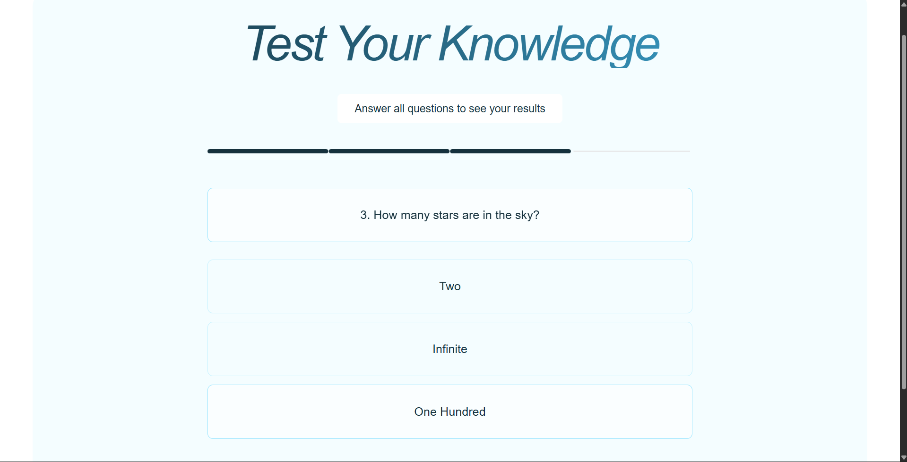

# 🧠 Test Your Knowledge — Quiz App  

A simple and interactive quiz application built using **React**, **TypeScript** and **Vite**.

🔗 **Live Demo:**  
https://marmik-vasava-frontend-assignment-bgxo32eeq.vercel.app/

---

## 🛠️ Tech Stack

| Technology | Purpose |
|-----------|---------|
| React | Frontend UI |
| TypeScript | Type safety & better developer experience |
| Vite | Fast build tool & development server |
| CSS | Styling and responsiveness |
| Vercel | Deployment & hosting |

---

## ✨ Key Features

- Multi-step quiz flow  
- Visual progress indicator  
- Answer selection with feedback  
- Score calculation after quiz ends  
- Final results screen with restart option  
- Fully responsive UI  
- Hosted online with Vercel  

---

## 🖼️ Screenshots

### 📍 Question Screen

### 📍 Final Result Screen

> Screenshots must be placed inside a folder: `screenshots/`

---

## 🧩 Assumptions

- One correct answer per question  
- All question data is stored locally  
- No backend / authentication required  

---

## ⏱ Time Spent on Assignment

| Task | Time |
|------|-----:|
| Initial setup | 1 hr |
| UI development + styling | 2–3 hrs |
| Quiz logic & components | 2 hrs |
| Testing & improvements | 1 hr |
| Deployment & documentation | 1 hr |
| **Total** | **7–8 hours** |

---

## 👤 Developer

**Marmik Vasava**  
Frontend Developer

📌 GitHub Profile:  
https://github.com/MarMiK-04  

🌍 Live Website:  
https://marmik-vasava-frontend-assignment-bgxo32eeq.vercel.app/

---

## 🚀 Future Enhancements (Optional)

- Add more question categories
- Timer for each question
- Save high scores (localStorage)
- UI animations between steps
- Backend support for dynamic quizzes

---
